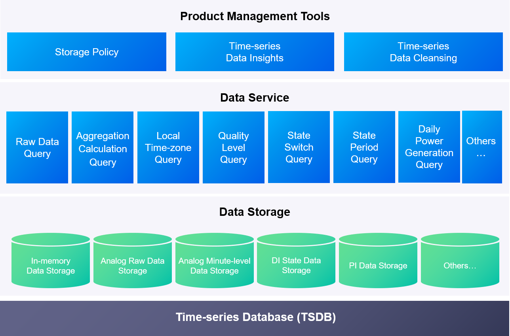

Managing Time Series Data
==============================

The EnOS Time Series Database (TSDB) provides efficient and stable storage management for time series data that is ingested from devices or generated by the stream processing engine.

|

The major components and architecture of EnOS Time Series Data Management is show in the figure below.

|

Storage Policy
------------------
Besides being able to store huge amounts of time series data, the EnOS TSDB can also quickly query and visualize these data. You can classify and store the data based on your data storage and read requirements, thereby reducing data storage costs and enhancing data reading efficiency. For more information, see:

.. toctree::
   :maxdepth: 1

   policy

Data Insights
------------------
With the Data Insights feature, you can view the latest data ingested from your devices and also generate a chart for the time series data stored in TSDB by selecting a specific time range and device measurement points. For more information, see:

.. toctree::
   :maxdepth: 1

   insights

Data Deletion
------------------
With the Data Deletion feature, you can delete the historical data stored in TSDB, thus releasing storage resource and saving data storage costs. For more information, see:

.. toctree::
   :maxdepth: 1

   cleanup
